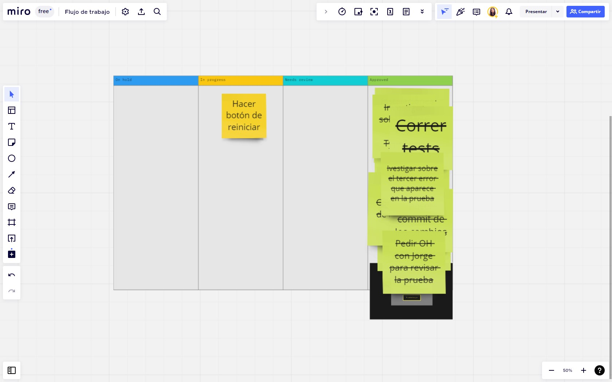
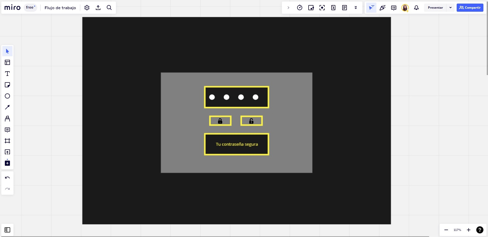
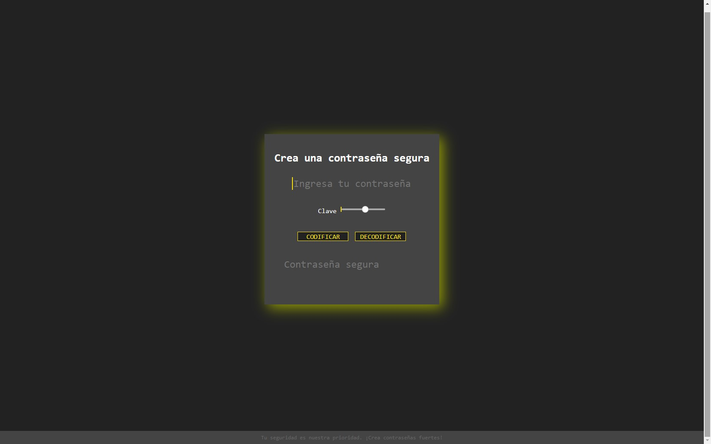
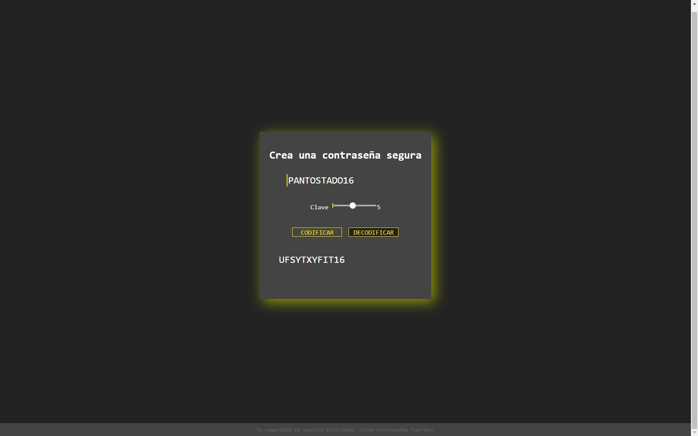
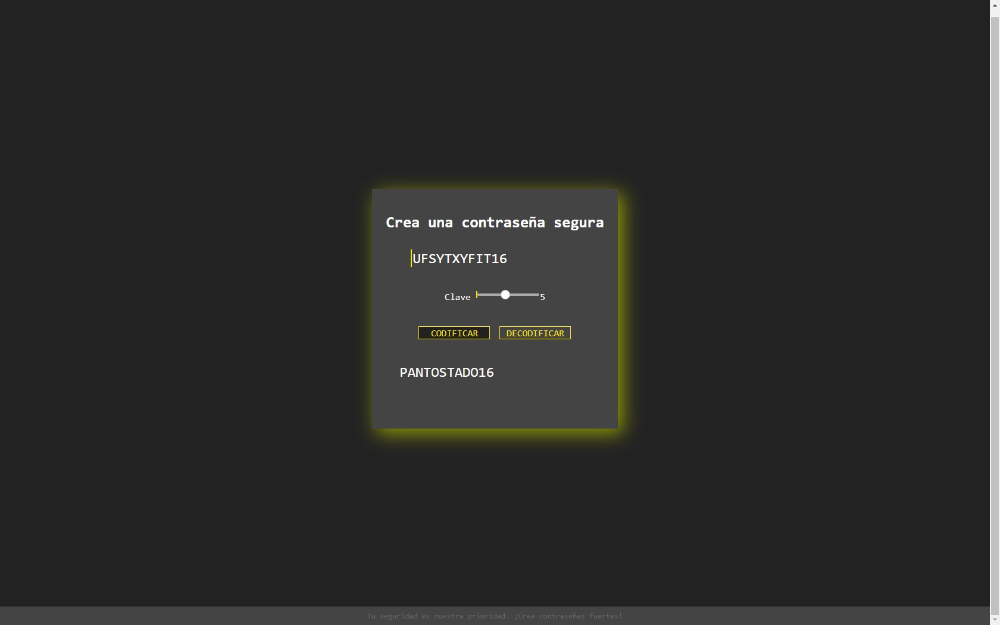
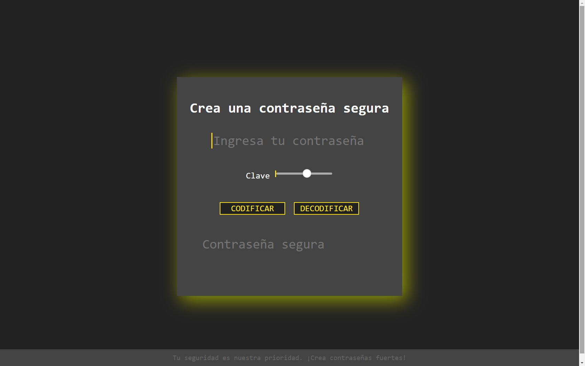

# Cifrado César

## 1. ¿Quiénes son los principales usuarios del producto?

Usuarios conscientes de la seguridad: Aquellos usuarios que valoran la seguridad y privacidad de sus cuentas y datos personales, y que desean contraseñas sólidas para evitar posibles ataques.

## 2. ¿Cómo este producto les está ayudando con el problema de seguridad?

Es importante tener en cuenta que la seguridad de las contraseñs es fundamental, para proteger la información personal. Esta aplicación proporciona una herramienta útil para aquellos que desean fortalecer sus medidas de seguridad digital, además, es muy fácil de usar.

## 3. ¿Cómo funciona el cifrado César?

Cifrar significa ocultar el contenido de un mensaje (en este caso, una contraseña) a simple vista, de manera que sólo las partes autorizadas pueden descifrar un texto cifrado.
El [cifrado César](https://en.wikipedia.org/wiki/Caesar_cipher)
es uno de los primeros métodos de cifrado conocidos. El emperador romano Julio
César lo usaba para enviar órdenes secretas a sus generales en los campos de
batalla.

El cifrado césar es una de las técnicas más simples para cifrar un mensaje. Es
un tipo de cifrado por sustitución, es decir que cada letra del texto original
es reemplazada por otra que se encuentra un número fijo de posiciones
(desplazamiento) más adelante en el mismo alfabeto.

Por ejemplo, si usamos un desplazamiento (_offset_) de 3 posiciones:

* La letra A se cifra como D.
* La palabra CASA se cifra como FDVD.
* Alfabeto sin cifrar: A B C D E F G H I J K L M N O P Q R S T U V W X Y Z
* Alfabeto cifrado: D E F G H I J K L M N O P Q R S T U V W X Y Z A B C

En la actualidad, todos los cifrados de sustitución simple se descifran con
mucha facilidad y, aunque en la práctica no ofrecen mucha seguridad en la
comunicación por sí mismos; el cifrado César sí puede formar parte de sistemas
más complejos de codificación, como el cifrado Vigenère, e incluso tiene
aplicación en el sistema ROT13.

## 4. ¿Cómo funciona esta herramienta?

<!-- **1. El usuario debe tener instalados:**

  - [Node.js](https://nodejs.org/) y [git](https://git-scm.com/download/) Si estas en    Linux es muy probable que ya este instalado 👀.
  - Luego en una [shell](https://curriculum.laboratoria.la/es/topics/shell). Si estas en Windows puedes usar Git Bash.
  - Para arrancar el servidor web `npm start` y dirígete a
   `http://localhost:3000` en tu navegador. -->

**1. Cifrar una contraseña**

  - Ingresamos la contraseña que queremos cifrar.
  - Elegir un numero de desplazamiento (_clave_) indicando cuántas
    posiciones quieres que el cifrado desplace cada caracter en el alfabeto (solamente mayúsculas y sin ñ).
  - Ver el resultado de la contraseña cifrada.

**2.Descifrar la contraseña**

  Si hemos olvidado la contraseña que habíamos ingresado y buscamos descifrarla debemos:
  
  - Insertar el código/letras/palabras que quieres descifrar. El mensaje usa alfabeto
    simplificado (solamente mayúsculas y sin ñ).
  - Elegir un numero desplazamiento (_clave_, que corresponda al que usamos
    para cifrar) indicando cuántas posiciones quieres que el cifrado desplace cada caracter en el alfabeto.
  - Ver el resultado de la contraseña descifrada.

En esta herramienta buscamos que sea fácil e intuitiva, simple y práctica, y así es como está pensado su diseño. Más adelante te hablaremos de esto con mayor detalle.

Esperamos que puedas sacarle el mayor provecho. 

## 5. Proceso de diseño

### 5.1 Flujo de trabajo y organización
Para poder realizar este proyecto empecé creando un boceto y las tareas que debía realizar para lograr el objetivo apoyándome de [Miro](https://miro.com/app/board/uXjVM0ahpsA=/).

### 5.2 Diseño
El diseño de esta herramienta es sencillo, minimalista y fácil de usar. La interfaz es sencilla y misteriosa 🕵🏻‍♀️.

 - La primera vista que tiene el usuario es una pantalla oscura con un recuadro en el centro, donde se hará el cifrado y descifrado de su contraseña.

 - Ingresamos la contraseña que queremos cifrar, damos click en "Cifrar", la respuesta que nos da abajo es lo que podemos usar como contraseña segura.

 - Para descifrar nuestra contraseña en caso de que lo hayamos olvidado o queramos confirmarla, copiamos el resultado para pegarlo en el primer recuadro y damos click en "Descifrar" y confirmamos que sea el texto o palabra que ingresamos al principio. 

****

**. Pruebas unitarios de los métodos.**  
Los metódos de `cipher` (`encode` y `decode`) deben tener cobertura con pruebas unitarias.

******

Usa nuestro [cifrador aquí](https://ivonneconde.github.io/DEV010-cipher/)

#### Desarrolladora 
Ivonne Rodríguez Conde, desarrolladora en proceso con [Laboratoria](https://www.laboratoria.la/)

#### "Contraseñas fuertes para una mayor protección en línea."